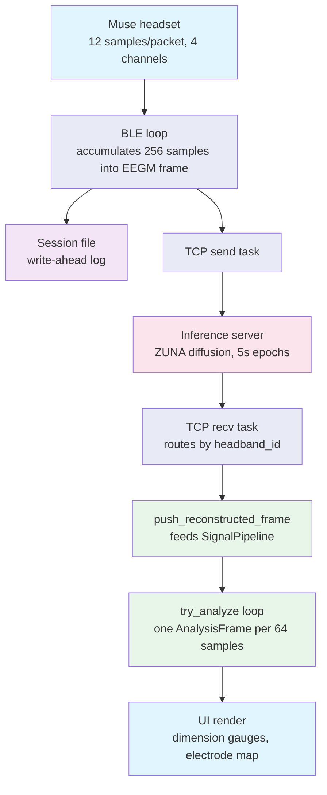

# eeg-viewer

Multi-Muse EEG viewer with per-device recording and real-time ZUNA inference overlay.

## What it does

- Connects up to 4 Muse headsets over BLE with per-device tabbed waveforms
- Runs four psychological dimension measurements on **inference-reconstructed data** (Absorption, Attunement, The Unknown, Witnessed)
- Two visualization modes: **Neural Aura** (arc gauge cards) and **Brain Topography** (wireframe head map with electrode glow)
- Records independently per device to FIF files
- Streams raw EEG to a Python inference server over TCP using the EEGM binary protocol
- Overlays reconstructed (ZUNA-inferred) EEG at the correct time position on the original trace
- **Session management** — start/end named sessions that capture both raw and reconstructed EEGM data per device into organized folders
- Every outbound frame is write-ahead logged to a per-device session file before entering the TCP path
- On server reconnect, replays unsent frames automatically from the session file offset
- `--simulate` mode for full UI testing without hardware
- Legacy stdin and TCP pipe modes still work with `--stdin` or `--tcp` flags

## Timestamp-aligned overlay

Each EEGM frame carries a `timestamp_us` field (microseconds since Unix epoch). The BLE loop stamps outgoing frames with `SystemTime::now()`. The inference server threads this timestamp through its epoch buffer, ZUNA pipeline, and back in the response. The viewer converts timestamps to seconds relative to the first frame and stores plot data as `[time_secs, amplitude]` pairs. When reconstructed data arrives — potentially 30-75 seconds after the original capture — it gets placed at the correct x-position on the plot, directly overlapping the raw trace it was inferred from.

If the server sends `timestamp_us=0` (old server or echo mode without timestamp support), the viewer falls back to appending at the current end of the raw timeline.

## Wire protocol

```text
Inference server API contract (EEGM/EEGC binary protocol over plain TCP)

1. Viewer connects to server
2. Viewer sends ConnectReq (24 bytes, little-endian)

   offset  type   value
   0       u32    magic 0x45454743 ("EEGC")
   4       u32    msg_type = 1
   8       u32    protocol_version = 1
   12      u32    n_headbands (1-4)
   16      u32    sample_rate (256)
   20      u32    reserved = 0

3. Server replies ConnectAck (24 bytes, same layout, msg_type = 2, status 0 = OK)

4. Viewer streams EEGM data frames (variable length, little-endian)

   offset  type                          value
   0       u32                           magic 0x4545474D ("EEGM")
   4       u32                           headband_id (0-3)
   8       u32                           epoch_seq (monotonic per headband)
   12      u32                           n_channels
   16      u32                           n_samples per channel
   20      u64                           timestamp_us (capture time, microseconds)
   28      f32[n_channels * n_samples]   channel-major payload

   total frame size = 28 + 4 * n_channels * n_samples bytes

5. Server sends reconstructed EEGM frames back using the same 28-byte header
   with the original timestamp_us preserved, routed by headband_id
```

## Build

```bash
cd app/eeg-viewer && cargo build --release
```

## Usage

### Start the inference server

Echo mode returns frames immediately without GPU inference. Use it to verify handshake, TCP plumbing, session replay, and UI rendering.

```bash
cd services/inference-server
python -m inference_server.server --port 41820 --echo
```

Production mode runs ZUNA diffusion workers on buffered 5-second epochs.

```bash
python -m inference_server.server --port 41820 --workers 8
```

### Admin endpoint

The server exposes an HTTP admin endpoint on port + 1 (default: 9101) for remote management.

```bash
# Server stats
curl http://192.168.1.101:9101/status

# Pull latest code and restart the process
curl -X POST http://192.168.1.101:9101/restart

# Clean shutdown
curl -X POST http://192.168.1.101:9101/shutdown

# Print glyph receipt on the server's USB printer
curl -X POST http://192.168.1.101:9101/print \
  -H "Content-Type: application/json" \
  -d '{"absorption":"deep","attunement":"porous","unknown":"lean_in","witnessed":"approach"}'
```

Override with `--admin-port 8080` if the default conflicts.

### Connect the viewer

```bash
cd app/eeg-viewer
./target/release/eeg-viewer --server 127.0.0.1:41820
```

Click Scan to find Muse headsets, click a device to connect, then click Connect Server. The bottom status bar shows frame counters for local processing, disk writes, and server sends. Reconstructed traces overlay in red at the original capture timestamp.

## Data packet flow

All dimension measurements run on reconstructed data from the inference server, not raw Muse data.

### Packet path

1. Muse sends BLE packets, 12 samples per electrode, 4 channels
2. BLE loop (`muse_ble.rs`) accumulates 256 samples per channel into one EEGM frame, stamps `timestamp_us` from `SystemTime::now()`
3. Frame written to session file (write-ahead log), then sent to inference server over TCP
4. Server runs ZUNA diffusion on 5-second epochs, preserves `timestamp_us`, sends reconstructed EEGM frame back
5. TCP recv task routes response by `headband_id` to `DeviceState::push_reconstructed_frame()`
6. `push_reconstructed_frame` feeds samples into `SignalPipeline`, which drains ACT worker results via `try_recv` and produces analysis frames in a `while` loop
7. Each frame stored as `DeviceState.analysis`, read by the UI on the next render tick



### Session management

Named sessions group raw and reconstructed data per device into a single folder. The toolbar shows a session name text field (auto-populated as `session_1`, `session_2`, etc.) and Start/End buttons.

- **Start Session** creates `{zuna_dir}/sessions/{name}/`, opens `{device}_raw.eegm` and `{device}_recon.eegm` writers for each connected device
- Raw EEGM frames written inside the BLE task's DeviceState lock, alongside the existing WAL write
- Reconstructed EEGM frames written inside the TCP recv task's DeviceState lock, before `push_reconstructed_frame`
- **End Session** closes all session writers, resets the name input to the next available number
- Devices connecting mid-session automatically get session writers opened
- The existing WAL at `sessions/{device}_{ts}.eegm` continues independently for reconnect replay

```text
{zuna_dir}/sessions/
  Muse-AB12_1234567890.eegm      # WAL (always, unchanged)
  session_1/
    Muse-AB12_raw.eegm            # raw BLE frames during session
    Muse-AB12_recon.eegm          # reconstructed frames during session
  session_2/
    ...
```

### Analysis hop rate

`SignalPipeline` produces one `AnalysisFrame` every 64 samples on the TP9 channel, roughly 4 frames/sec at 256 Hz. Each server response carries ~256 samples. The pipeline subtracts `HOP_SAMPLES` from the hop counter per iteration instead of resetting to zero, so a single `push_reconstructed_frame` call produces ~4 analysis frames.

### Reconstructed-data mode

Pipeline created via `SignalPipeline::new_for_reconstructed()` with `trust_input = true`. Skips contact quality tracking and the 150 uV epoch amplitude limit. The inference server already denoises the signal; raw-BLE artifact checks reject reconstructed epochs due to higher amplitude scaling.

### Detector timing

- Phases advance by snapshot/window count, not wall clock (except alpha trend settling which uses wall clock)
- Settling and measuring phases stall until inference data arrives
- Progress bars reflect actual data volume; alpha trend shows elapsed time instead of percentage
- Detectors run until manual stop (no auto-completion). Progress buttons show elapsed seconds.
- **All-devices mode**: gear icon → "All devices" checkbox (on by default). Each Start/Stop button dispatches to every connected Muse simultaneously.

The Neural Aura panel shows a status banner indicating inference connectivity and data flow.

### Dimension analysis

ACT (Adaptive Chirplet Transform) runs only for Attunement. The other three dimensions use FFT-based analysis.

**Absorption (Alpha Trend)**

Online linear regression on frontal alpha power (AF7 + AF8 mean). No separate baseline phase required.

1. User clicks "Start Absorption", `AlphaTrendDetector::start()` begins a 5-second settling period
2. Each analysis hop, frontal alpha is averaged from the FFT snapshot and pushed into the regression accumulator
3. Only accumulates when both AF7 and AF8 have clean epochs and good contact
4. Computes normalised slope: `trend_pct_per_min = (slope / mean_alpha) × 60 × 100`
5. Classification: Rising if trend > +2 %/min, Falling if < −2 %/min, Flat otherwise
6. R² measures goodness of fit. Measurement runs until the user stops it

**Attunement (ACT-based)**

ACT runs on a dedicated `act-worker` OS thread to avoid blocking the data path. The pipeline sends work items via a bounded(2) `mpsc` channel and collects results with non-blocking `try_recv`.

1. User clicks "Start Attunement", `EntrainmentDetector::start_without_engine()` resets detector state, then `start_act_worker()` sends a `Start` command to the worker thread which creates the `ActEngine` with a low-frequency dictionary: fc 0.5-4.0 Hz, 1024-sample windows, order 7 chirplets
2. Each analysis hop, 4-channel filtered EEG windows are sent to the worker via `try_send`. If the worker is busy (channel full), the window is dropped — measurement extends naturally since `measuring_count` only increments on result arrival
3. The worker calls `engine.transform_batch()` via FFI into the C++ ACT library (80-200ms, off data path):
   - Coarse search: GPU GEMM of signal against all dictionary atoms (MLX on macOS, CPU on Linux)
   - Greedy matching pursuit: extract top-7 chirplets iteratively, subtract best match each round
   - BFGS refinement (optional): fine-tune each chirplet's `(tc, fc, logDt, c)` parameters via ALGLIB
4. Results return via `mpsc` channel. `drain_act_results()` applies them to the detector's `ChannelAccum` accumulators. Each chirplet's `fc` checked against `beat_freq +/- tolerance` (default 2.0 +/- 0.5 Hz). Beat-matching chirplets contribute to `beat_energy`, all contribute to `total_energy`
5. Entrainment SNR = `beat_energy / (total_energy - beat_energy)`. Above 1.5 threshold = Porous, below = Boundaried

**Unknown / Witnessed (Approach)**

Frontal alpha asymmetry: `(AF8 - AF7) / (AF8 + AF7)`. Positive = Lean, negative = Hold

### Simulate mode

The `--simulate` flag spawns a fake Muse device generating synthetic 4-channel EEG at 256 Hz. Each channel has a different alpha amplitude and a slow independent envelope so the topography dots visibly pulse. Dimension analysis requires a connected inference server — the simulated device streams raw data to the server, and analysis runs on the reconstructed responses.

```bash
cd app/eeg-viewer
cargo run --release -- --simulate
```

This is the fastest way to iterate on visualization code or verify the dimension measurement flow end-to-end.

### Test server integration

The `eegm-test-sender` generates synthetic multi-headband EEG with realistic signal profiles (alpha, theta, beta, mixed) and timestamps.

```bash
cargo run --release --bin eegm-test-sender -- --target 127.0.0.1:41820 --headbands 4
```

## Flags

| Flag | Description |
| ---- | ----------- |
| `--simulate` | Launch with a simulated Muse device (synthetic EEG, no BLE) |
| `--server ADDR` | Connect to inference server at ADDR |
| `--stdin` | Read EEGF/EEGD from stdin, disables BLE |
| `--tcp ADDR` | Listen for one TCP client, disables BLE |
| `--no-muse-ble` | Disable BLE, empty plot unless `--stdin` or `--tcp` |
| `--max-points N` | Rolling buffer length per channel (default: 8192) |
| `--zuna-dir PATH` | ZUNA root containing `run_fif_pipeline.py` |
| `--muse-record-bin PATH` | Path to `muse-record-fif` binary |
